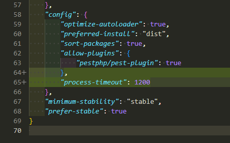

## Pasos para crear proyecto con docker

Este es un crud basico utilizando docker y sql server
El proyecto esta construido de la siguiente manera:

1. Autenticación de usuario segura vía Laravel/Breeze.
2. ⁠Presentación de un home con un menú básico.
3. ⁠Creación de un CRUD con todas sus características.
4. ⁠Generación de un reporte con datos masivos, por lo menos 30.000 registros, 
utilizando trabajos de segundo plano (worker).
"Para los 30.000 registros se creo un seeder"
5. ⁠Generación de un reporte sencillo en PDF. "Utilizando DomPdf"
6. ⁠Manejo de peticiones seguras (form request). "Validacion de datos"

## 1 

Clonar repositorio una vez realizada dicha accion se debe 
crear carpeta data_sql_server en la misma linea de carpetas de dockerfiles, nginx etc

## 2
Crear imagenes de docker
docker-compose up -d

## 3 
Puede vaciar la carpeta .src y crear proyecto laravel este lo mapeara en .src
docker-compose run composer create-project laravel/laravel:^10.0 .

Si quiere continuar con este proyecto debe generar la key de laravel y instalar paquetes npm install
docker-compose run --rm artisan key:generate

-instalar vendor
En el composer.json agregar en "config": agregar 
"process-timeout": 1200
Esto para agregar tiempo en la descarga del vendor con docker local

docker-compose run --rm composer install

## 4 
En .env
DB_CONNECTION=sqlsrv
DB_HOST=host.docker.internal
DB_PORT=1433
DB_DATABASE=nombre_database
DB_USERNAME=sa
DB_PASSWORD='YourStrong#Password'

Correr migraciones
docker-compose run --rm artisan migrate

server: http://localhost:8080/